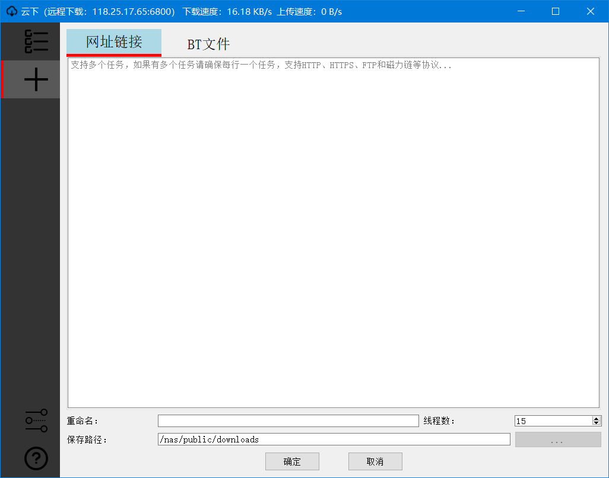

一款PyQt5写的aria2图形前端。
计划支持Linux、Windows和MAC三种系统。目前已经支持Windows、Linux系统。

# 主要特性

1、支持管理远程和本地下载服务器。

2、自带aria2c程序，支持aria2c的所有功能。下载软件该有的基本功能应该都有了。

# 已知问题

1、简体中文界面有些部分还是英文。该问题时QT的多语言机制导致的，正在找解决办法。

# 下个版本支持

1、下载任务列表支持排序。

2、支持指定FTP、SFTP用户名和密码。

3、支持即使改变界面语言。

4、支持换肤。

# 安装方法

## Windows

1、下载绿色[安装包](https://github.com/xxNull-lsk/Cloudown/releases)

2、解压后双击运行Cloudown.exe

## Linux

1、下载[安装包](https://github.com/xxNull-lsk/Cloudown/releases)

2、解压后运行以下指令进行安装：

`sudo bash install.sh`

3、可以通过以下指令进行卸载：

`sudo bash uninstall.sh`

# 更新历史

## 0.2

1、支持Linux系统

2、采用多线程提升界面响应速度。

3、支持多语言。（嗯，英语时我自己写的，很烂）

4、解决若干界面的BUG。

## 0.1

第一次发布，包含了下载软件的基本核心功能。

# 截图
## 本地下载模式

## 远程下载模式：

## 查看详细信息

## 添加任务

## 配置界面

## 关于
